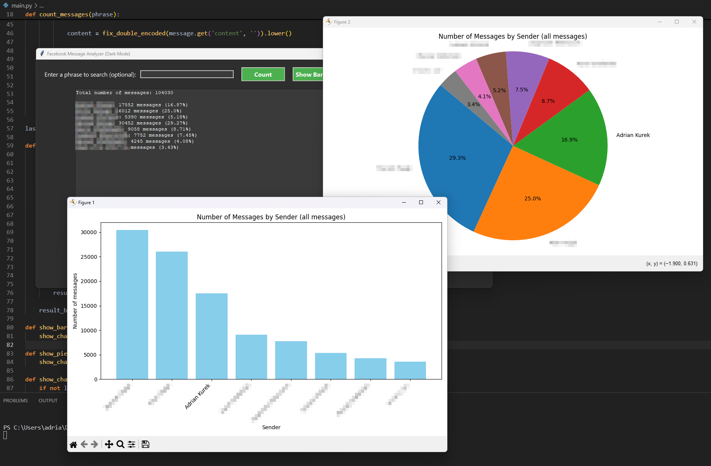

> [!note]
> 
> A Python app that tracks and counts the messages you send and receive from friends, helping you analyze your chat activity easily. Place `main.py` file inside of the specific conversation folder downloaded from Facebook
>
> `(e.g. ...\your_facebook_activity\messages\inbox\conversation_name)`.
>
> Then run the following command: 
> 
> ```python
> py main.py
> ```


